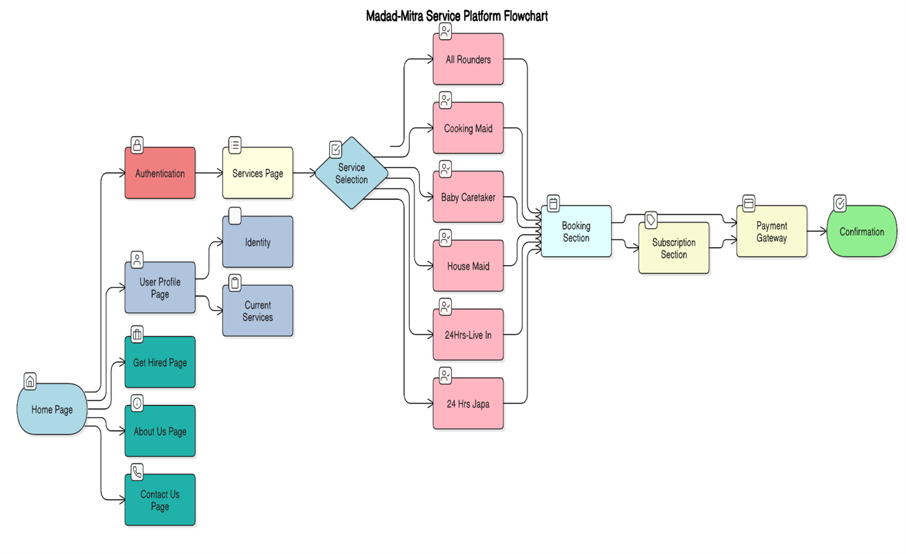

# Madad-Mitra
A revolutionary platform connecting households with verified domestic service professionals.

## Vision

To revolutionize the domestic service industry by creating a seamless, trusted platform that enhances the quality of life for households while providing sustainable employment opportunities for service professionals.

## Mission

To deliver reliable, professional-grade domestic services through a user-friendly platform that connects households with verified service providers, offering customizable subscription plans that meet diverse household needs.

## Introduction

Madad-Mitra represents an innovative solution in the domestic service industry, designed to bridge the gap between households seeking reliable domestic help and verified service professionals. The platform addresses the growing demand for organized, trustworthy domestic services in urban areas by offering a comprehensive digital marketplace for various household services including cooking, cleaning, childcare, and full-time domestic assistance.

Through its subscription-based model, Madad-Mitra ensures consistent service delivery while providing flexible options that cater to diverse household needs.

## Technical Stack

### Frontend
- React.js
- Redux for state management
- Responsive UI components
- Razorpay integration for payments

### Backend
- Node.js
- Express.js
- MongoDB
- JWT for authentication
- RESTful APIs

## Features
- User authentication and verification
- Service booking system
- Profile management
- Subscription handling
- Secure payment processing
- Service provider registration

## Process Flow

1. **Platform Access**
   - Access through Home Page
   - Identity verification via Authentication

2. **Service Discovery**
   - Browse Services Page
   - View available domestic help options

3. **Service Selection**
   - Choose service category
   - Available services:
     - All Rounders
     - Cooking Maid
     - Baby Caretaker
     - House Maid
     - 24Hrs-Live In
     - 24 Hrs Japa

4. **Booking Process**
   - Schedule service
   - Select subscription duration
   - Complete payment
   - Receive confirmation
   
## Additional Features

### User Dashboard
- Profile management
- Current services overview
- Booking history

### Service Provider Portal
- Registration through Get Hired Page
- Profile creation
- Service management

## How It Works




This flowchart illustrates the intricate web of Madad-Mitra's functionality. 

### Support
- About Us page
- Contact Us page for assistance
- Customer support integration

## Getting Started

1. **Clone the repository:**

   ```bash
   git clone https://github.com/Harshitkukreja31/Madad-Mitra.git
   ```
2. **Change Directory:**

   ```bash
   cd Mada-Mitra
   ```
3. **Install dependencies for both frontend and backend:**
   - Frontend
   ```bash
   cd Helpify
   npm install
   ```

   - Backend
   ```bash
   cd Helpify-backend
   npm install
   ```

4. **Set up environment variables for both frontend and backend (e.g., database connection, Razorpay API key)**

5. **Run the application:**

  - Frontend 
  ```bash
   cd Helpify
   npm run dev
   ```
 - Backend 
  ```bash
   cd Helpify
   nodemon index.js
   ```

## Deployment

Madad-Mitra is now live and accessible to everyone! You can visit our deployed application at:

[http://ec2-13-61-26-86.eu-north-1.compute.amazonaws.com:8080/](http://ec2-13-61-26-86.eu-north-1.compute.amazonaws.com:8080/)

## Contributing

  Contributions are welcome! If you'd like to contribute to this project, please follow these     guidelines:

  1. Fork the repository.
  2. Create a new branch: ```git checkout -b feature/your-feature-name```.
  3. Make your changes and commit them: ```git commit -m 'New:Add some feature'```.
  4. Push to the branch: ```git push origin feature/your-feature-name```.
  5. Open a pull request to the `main` branch of this repository.
<br/>
